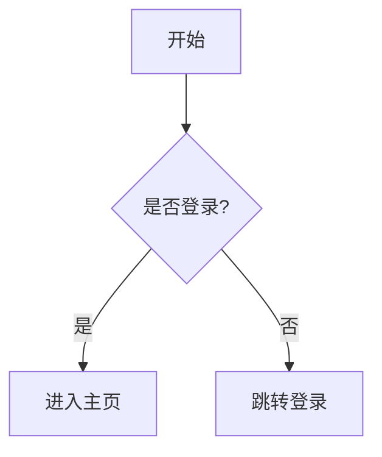

# 博客图片补充与优化规范

此技能在内容核心草稿完成后调用（`/enrich`），旨在为文章补充丰富的视觉表达，如占位描述、架构图或时序图。

## 1. 插图类型与应用场景

### 1.1 实际图片
适用于：摄影、艺术作品展示、实际界面截图、实物照片、实验结果。

### 1.2 示意图
适用于：流程说明、概念解释、结构展示、对比说明。

### 1.3 Mermaid 图表
适用于：简单流程图、架构图、时序图、甘特图、状态图。

## 2. 图片描述预留规范

如果尚未准备好实际图片，必须**先写图片描述**预留占位符。

### 2.1 描述格式
```markdown
<!-- IMAGE:
标题：[图片标题]
类型：[截图/示意图/照片/图表/封面图]
内容：[图片内容描述]
用途：[为什么要这张图]
尺寸建议：[可选，如 16:9, 1:1, 1200:630]
-->

[图片预留：图片标题]
```

### 2.2 封面示例
```markdown
<!-- IMAGE:
标题：拒绝 AI 焦虑：构建你的闭环学习系统，让 AI 成为真正的外挂大脑
类型：封面图
内容：背景使用渐变色，叠加半透明文章关键字（四个字左右）“生成式AI”，在中间加一个ICON/LOGO
用途：帮助读者快速了解文章内容
尺寸建议：宽屏 1200:630
-->


```

## 3. Mermaid 图表规范

### 3.1 何时使用 Mermaid
- 需要展示流程、架构、关系
- 图片后续可能需要修改，希望保持版本控制
- 不需要复杂的视觉效果

### 3.2 写作规范
- 命名清晰：节点和箭头标签要能说明意思
- 不要过于复杂：超过 10 个节点考虑拆分
- 添加图例说明：在图下方简要说明
- 方向选择：TD/TB（上下）、LR（左右）根据内容选择

#### 示例：流程图 (Flowchart)


## 4. 图片使用规范

### 4.1 文件命名
```
[类型]-[内容]-[序号].[格式]
示例：
- screenshot-login-page-01.png
- diagram-data-flow.png
- photo-coffee-latte-01.jpg
```

### 4.2 Alt 文本
每张插入的图片都必须有 alt 文本：
```markdown

```

### 4.3 图片位置
- 图片应该紧跟相关段落。
- 技术教程：每个步骤配图。
- 艺术博客：作品图在描述前或后。